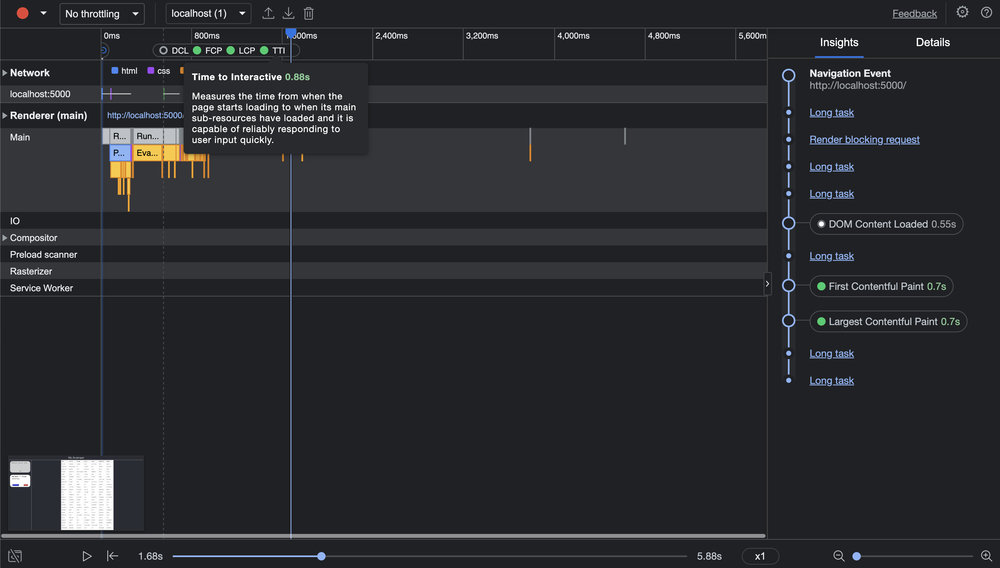
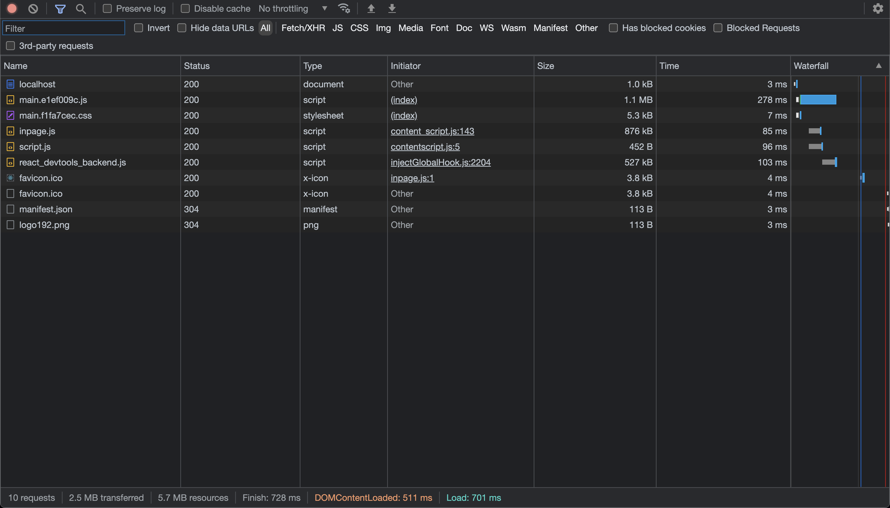

# SQL ScratchPad

## Overview
* The user can create SQL queries and they will be stored in the scrathpad
* They can be updated, deleted & re-executed ad-hoc

## Ideation
* Every query will be shown in the history
* It can be seen every time by clicking on the item
* Also there are options to edit, delete & re-execute the query
* Validations are added for empty & duplicate case
* In case of duplicate, the user is scrolled & navigated to executed query, with warning message
    * This is done inorder to avoid re-fecthing of huge data in realtime

## Libraries used
* react - UI framework
* @faker-js/faker - Generate fake data for table population
* @glideapps/glide-data-grid - High performance data grid
* react-toastify - Toast message to be displayed for user

## Page Load time
* TTI - 0.88s

* Asset load time - 728ms

* The stats are calculated from the Chrome dev tools (screenshots above)

## Optimizations done
* The re-render of table cells in the data-grid is prevented by caching
* The data grid library is chosen based on JS size, features & scaling to [a million of rows](https://grid.glideapps.com/)
